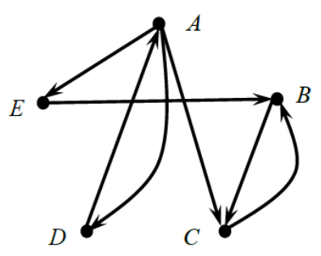
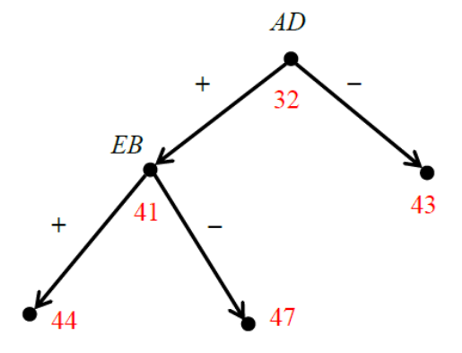
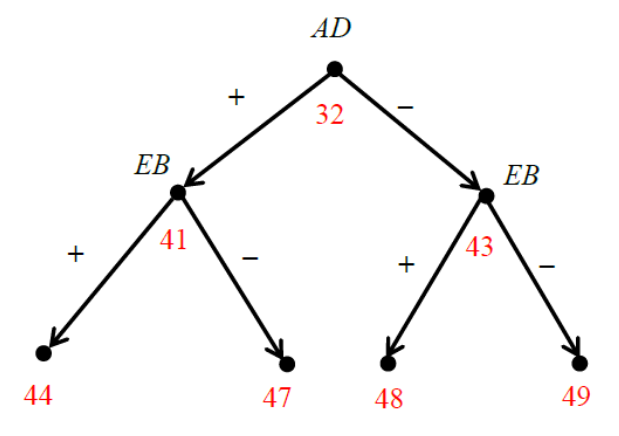
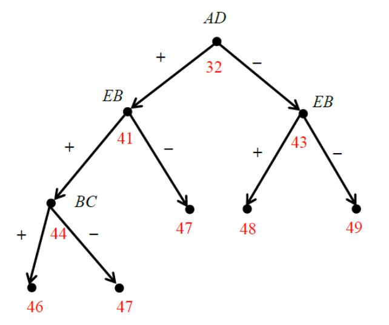

Конспект с задачами на КР 2

Конспект с задачами на КР

Содержание:
1. [Паросочетания](#title-1)
2. [Задача о назначении. Венгерский алгоритм](#title-2)
3. [Задача о максимальном потоке](#title-3)
4. [Задача о максимальном потоке минимальной стоимости](#title-4)
5. [Метод ветвей и границ](#title-5)
6. [Метод ветвей и границ. Задача о коммивояжере. Алгоритм Литтла](#title-6)
7. [Генетический алгоритм. Понятия, пример решения задачи о рюкзаке](#title-7)
8. [Генетический алгоритм. Задача коммивояжёра](#title-8)

---

# 1. <a id="title-1">Паросочетания.</a>

## 💡 Теорема

Справедлива следующая теорема, принадлежащая Клоду Бержу.

> Паросочетание $М$ в двудольном графе является максимальным тогда и только тогда, когда в этом графе нет цепей, чередующихся относительно паросочетания $М$.

## 📌 Поиск максимального паросочетания

Рассмотрим алгоритм для нахождения максимального паросочетания в двудольном графе, использующий чередующиеся цепи. 

Сначала в графе выбирается произвольное паросочетание (это может быть просто отдельное ребро графа). Оно объявляется **текущим паросочетанием**.

Далее на каждом шаге алгоритм находит цепь, чередующуюся относительно текущего паросочетания. Если такая цепь $Р$ найдена, то все ребра этой цепи, принадлежащие текущему паросочетанию $М$, исключаются из него, а все ребра цепи $Р$, не принадлежащие паросочетанию $М$, добавляются в него. 

Полученное паросочетание $М'$ объявляется новым текущим паросочетанием. Оно содержит ровно на одно ребро больше, чем предыдущее текущее паросочетание $М$. 

На следующем шаге снова ищется цепь, чередующаяся относительно нового текущего паросочетания $М'$ и т.д. После каждого шага количество рёбер в текущем паросочетании увеличивается ровно на единицу. Если на очередном шаге не найдётся ни одной цепи, чередующейся относительно текущего паросочетания, то это паросочетание объявляется **максимальным** и алгоритм завершает работу.

---

## 📌 Волновой метод

Основной процедурой описанного алгоритма является поиск цепи $Р$, чередующейся относительно текущего паросочетания $М$. Он осуществляется **«волновым методом»**. 

Сначала формируется нулевой фронт волны - это множество всех свободных (т.е. не покрытых текущим паросочетанием $М$) вершин, принадлежащих одной доле исходного графа. 

Если $k$-й фронт уже построен, то $(k + 1)$-й фронт будет состоять из вершин, которые **не встречались** в предыдущих фронтах. При чётных $k$ дополнительно требуется, чтобы каждая вершина $(k + 1)$-го фронта была смежна хотя бы с одной вершиной $k$-го фронта, а при нечётных $k$ каждая вершина $(k + 1)$-го фронта должна соединяться ровно с одной вершиной $k$-го фронта ребром, принадлежащим паросочетанию $М$. 

Поиск цепи $Р$ заканчивается, как только в очередном фронте появится свободная (т.е. не покрытая паросочетанием $М$) вершина, либо очередной фронт окажется пустым. В первом случае чередующаяся цепь соединяет свободные вершины, одна из которых принадлежит нулевому, а другая - последнему фронту. Во втором случае чередующейся цепи не существует.

---

Паросочетание, которое покрывает все вершины графа, называется **совершенным паросочетанием**. 

Критерий существования совершенного паросочетания в двудольном графе сформулирован в теореме Холла.

## 💡 Теорема Холла

> Для существования совершенного паросочетания в двудольном графе необходимо и достаточно, чтобы в нём для каждого подмножества $S_1$ вершин из первой доли графа и множества $S_2$ всех вершин из второй доли, смежных вершинам подмножества $S_1$, выполнялось неравенство:

$$
|S1| \leq |S2|.
$$

где $|S_1|$ и $|S_2|$ - количество вершин в $S_1$ и $S_2$ соответственно.

---

## 📌 Дерево чередующееся относительно паросочетания

Для поиска совершенного паросочетания в двудольном графе можно использовать понятие чередующегося (относительно паросочетания) дерева. Построение чередующегося относительно паросочетания $М$ дерева происходит методом «волны». 

Нулевой фронт волны - это произвольная свободная (т.е. не покрытая паросочетанием $М$) вершина. Она является корнем чередующегося дерева. Если $k$-й фронт уже построен, то каждая вершина $(k + 1)$-го фронта **не должна встречаться в предыдущих фронтах** и должна быть смежна ровно одной вершине $k$-го фронта. Кроме того, при нечетных $k$ каждая вершина $k$-го фронта должна соединяться ребром только с одной вершиной $(k + 1)$-го фронта, и это ребро обязано принадлежать паросочетанию $М$. В полученном дереве при движении от корня дерева к любой его концевой вершине будут чередоваться ребра, не принадлежащие и принадлежащие паросочетанию $М$.

Построение дерева завершается, как только в очередном фронте найдется свободная вершина, либо очередной фронт окажется пустым. В первом случае в дереве имеется цепь, чередующаяся относительно паросочетания $М$. Она соединяет корень и свободную концевую вершину дерева. С помощью этой цепи можно увеличить число ребер в паросочетании $М$. Во втором случае в полученном дереве нет ни одной чередующейся цепи. Это означает, что в исходном графе не существует совершенного паросочетания.

---

# <a id="title-2">Задача о назначении. Венгерский алгоритм.</a>

## 🎯 Задача о назначении

При решении некоторых практических задач приходится рассматривать полные двудольные графы, в которых каждое ребро имеет определенную стоимость. Например, стоимость ребра может означать материальные или временные затраты, возникающие при условии, что данный процесс будет выполнен данным исполнителем. В этом случае возникает задача о назначении, которая состоит в нахождении совершенного паросочетания с минимальной суммарной стоимостью. 

Если имеется $n$ процессов и $n$ исполнителей, то исходные данные для задачи о назначении представляют собой квадратную матрицу затрат $n$-го порядка, у которой на пересечении $i$-й строки и $j$-ro столбца находится неотрицательное число, указывающее затраты на выполнение $i$-го процесса $j$-м исполнителем. Очевидно, что в этом случае существует всего $n!$ возможных вариантов назначения. Поэтому при больших значениях параметра $n$ задачу невозможно решить полным перебором всех возможных вариантов.

Пример матрицы затрат для 4 процессов и 4 исполнителей.

$$ 
 \begin{pmatrix}    
  1 & 4 & 4 & 3 \\
  2 & 7 & 6 & 8 \\
  4 & 7 & 5 & 6 \\
  2 & 5 & 1 & 1 \\
 \end{pmatrix}
$$

## Редуцирование матрицы затрат

Отметим одну важную особенность задачи о назначении: если найдено оптимальное назначение для исходной матрицы затрат, то оно останется оптимальным и для преобразованной матрицы, полученной из исходной вычитанием произвольной константы из всех элементов какой-либо её строки или столбца. 

Например, пусть имеются процессы A и В и два исполнителя, а матрица затрат указана на рисунке.

$$
 \begin{pmatrix}    
  6 & 5 \\
  7 & 9 \\
 \end{pmatrix}
$$

Очевидно, в данном случае существует всего два назначения: $[A, 1], [B, 2]$ и $[A, 2], [B, 1]$. Стоимость первого из них равна 15, а второго — 12. т.е. второе назначение оптимально. Если из первой строки исходной матрицы вычесть 5, а из второй — 7, то получим матрицу, указанную на рисунке ниже, с тем же самым оптимальным назначением $[A, 2], [B, 1]$, стоимость которого равна нулю. 

$$
 \begin{pmatrix}    
  1 & 0 \\
  0 & 2 \\
 \end{pmatrix}
$$

Нетрудно видеть, что стоимость оптимального назначения при подобных преобразованиях исходной матрицы затрат уменьшается ровно на суммарную величину вычитаемых констант. Этот факт используется в *венгерском алгоритме*. 

Процедура упрощения матрицы затрат путем вычитания минимальных элементов из строк и затем из столбцов до тех пор, пока в каждой строке и столбце не появятся нули называется *Редуцированием матрицы затрат*.

## Венгерский алгоритм

Основная идея венгерского алгоритма состоит в том, чтобы найти какое-либо **совершенное паросочетание в двудольном графе**, структура которого существенно зависит от исходной матрицы затрат. Для этого проводится редуцирование матрицы затрат — из каждой строки исходной матрицы вычитают минимальный элемент строки, а затем из каждого столбца полученной матрицы вычитают минимальный элемент столбца. В результате в каждой строке и каждом столбце новой матрицы будет присутствозвать хотя бы один нулевой элемент. 

Далее в двудольном графе, имеющем по $n$ вершин в каждой доле, проводят ребро $[i,j]$ тогда и только тогда, когда элемент $a_{ij}$ преобразованной матрицы затрат равен нулю. Если в полученном двудольном графе удается с помощью чередующихся деревьев найти совершенное паросочетание, то входящие в него ребра указывают на оптимальное решение исходной задачи о назначении. 

Если же текущее чередующееся дерево не содержит ни одной чередующейся цепи, то в этом графе нет совершенного паросочетания. Поэтому в графе проводят дополнительные ребра и снова ищут совершенное паросочетание. Для этого выполняют следующие действия:
1. Определяют множества $X$ и $Y$ - номера всех вершин соответственно из первой и второй доли полученного двудольного графа, покрытых текущим чередующимся деревом;
2. Находят минимальный элемент (он всегда будет положительным) среди элементов преобразованной матрицы затрат, попавших в строки с номерами из множества $X$, но не попавших в столбцы с номерами из множества $Y$;
3. Найденный минимальный элемент вычитают из строк с номерами из множества $X$ и добавляют к столбцам с номерами из множества $Y$ (в результате в преобразованной матрице затрат появятся новые нулевые элементы);
4. В текущем двудольном графе добавляют ребра, соответствующие новым нулевым элементам преобразованной матрицы затрат;
5. В новом текущем двудольном графе ищут совершенное паросочетание с помощью чередующихся деревьев.

Указанную последовательность действий повторяют до тех пор, пока в текущем двудольном графе не будет найдено совершенное паросочетание. Входящие в него ребра, как было сказано выше, соответствуют оптимальному решению исходной задачи о назначении.

---

# 3. <a id="title-3">Задача о максимальном потоке</a>

## Алгоритм для нахождения максимального потока

Рассмотрим теперь алгоритм для нахождения максимального потока. Он состоит в постепенном наращивании уже имеющегося потока вдоль некоторого ориентированного пути из источника $s$ в сток $t$. Поиск такого пути осуществляется с помощью остаточной сети. Наращивание потока происходит до тех пор, пока его величина не станет максимально возможной для заданной сети. В качестве начального можно взять, например, нулевой поток.

Пусть после очередного увеличения потока в процессе работы алгоритма мы получили некоторый ненулевой поток. Построим соответствующую этому потоку остаточную сеть и найдём в ней какой-либо увеличивающий путь. Предположим, что это путь из дуг $e_{i},e_{j},...,e_{k}$. Через $d$ обозначим минимальный вес дуг, образующих этот путь. Уменьшим на величину $d$ веса всех дуг $e_{i},e_{j},...,e_{k}$. Дуги, веса которых станут после этого нулевыми, удалим из остаточной сети. 

Уменьшение весов дуг $e_{i},e_{j},e_{k}$ на величину $d$ в остаточной сети означает следующую корректировку локальных потоков в исходной сети:
1. Если дуга $e$ из увеличивающего пути существует в исходной сети, то локальный поток вдоль неё $f(e)$ уменьшается на величину $d$. 
2. Если же дуга $e$ в исходной сети отсутствует, то в ней имеется дуга, обратная по отношению к $e$. Уменьшение веса дуги $e$ на величину $d$ в остаточной сети означает уменьшение резерва в исходной сети, что эквивалентно увеличению локального потока вдоль дуги, обратной по отношению к $e$, на величину $d$. Вследствие указанной корректировки локальных потоков ровно на величину $d$ возрастает и величина потока. 

📌 Как уже было сказано, после нахождения увеличивающего пути в остаточной сети происходит корректировка обеих сетей – и остаточной, и исходной. 

В скорректированной остаточной сети снова ищут увеличивающий путь и корректируют обе сети и т.д. Алгоритм завершает работу, как только в остаточной сети не останется ни одного увеличивающего пути. В этот момент веса дуг в остаточной сети будут показывать реальные локальные потоки, а также неиспользованные резервы, что тоже может представлять интерес, например, для внесения изменений в исходную сеть (добавление дуг, повышение пропускных способностей дуг) с целью увеличить уже существующий поток.

---

# 4. <a id="title-4">Задача о максимальном потоке минимальной стоимости</a>

Алгоритм для нахождения максимального потока минимальной стоимости вначале находит какой-либо максимальный поток, а затем перераспределяет потоки вдоль некоторых дуг так, чтобы, с одной стороны, поток остался допустимым и его величина не уменьшилась, а, с другой стороны, его стоимость стала минимально возможной. 

## Остаточная сеть
Как и при решении задачи о максимальном потоке мы будем использовать остаточную сеть. Принципы её построения такие же, как и в задаче нахождения максимального потока. Есть только одно отличие: каждая дуга остаточной сети теперь имеет не только вес, но и стоимость.

Если в исходной сети уже найден некоторый максимальный поток, построим соответствующую ей остаточную сеть с тем же набором вершин, что и у исходной сети, применяя к каждой дуге исходной сети следующие правила:
1. Если дуга $e$ исходной сети является насыщенной, т.е. для неё выполняется равенство $f(e)=p(e)$, то в остаточной сети проводим такую же дугу с весом $p(e)$ и отрицательной стоимостью ( $-c(e)$ ), где $c(e)$ – стоимость перемещения единицы потока вдоль дуги $e$ в исходной сети;
2. Если дуга $e=[u,v]$ исходной сети является пустой, т.е. поток вдоль неё $f(e)$ равен нулю, то в остаточной сети проводим обратную дугу $[v,u]$ с весом $p(e)$ и стоимостью $c(e)$;
3. Если дуга $e=[u,v]$ исходной сети не является ни пустой, ни насыщенной, т.е. для неё выполняются неравенства $0<f(e)<p(e)$, то в остаточной сети проводим две дуги:
   - дугу $[u,v]$ с весом $f(e)$ и отрицательной стоимостью ( $-c(e)$ );
   - обратную дугу $[v,u]$ с весом $p(e)-f(e)$ и стоимостью $c(e)$.

Таким образом, в остаточной сети могут появиться дуги с отрицательной стоимостью. Далее под стоимостью ориентированного цикла в остаточной сети будем понимать сумму стоимостей всех дуг, образующих этот цикл.

## 💡 Теорема

Максимальный поток имеет минимальную стоимость тогда и только тогда, когда в соответствующей остаточной сети нет ни одного ориентированного цикла отрицательной стоимости.

## Алгоритм для нахождения максимального потока минимальной стоимости

Пусть в исходной сети уже найден некоторый максимальный поток. Если в соответствующей остаточной сети нет ни одного ориентированного цикла отрицательной стоимости, то алгоритм завершил работу, а найденный максимальный поток имеет минимально возможную стоимость.

Если же в остаточной сети есть ориентированный цикл $e_{i},e_{j},\dots ,e_{k}$ отрицательной стоимости $cost$, то через $d$ обозначим минимальный вес дуг, образующих этот цикл. 

В остаточной сети выполним следующие преобразования. Уменьшим на $d$ вес каждой из дуг $e_{i},e_{j},\dots ,e_{k}$ и удалим те из них, вес которых станет равным нулю. Одновременно увеличим на $d$ веса всех дуг, обратных по отношению к $e_{i},e_{j},\dots ,e_{k}$. Если какая-либо из дуг $e_{i},e_{j},\dots ,e_{k}$ в остаточной сети не имела обратной дуги, то в новой остаточной сети добавим такую дугу и положим её вес равным $d$.

Указанные преобразования остаточной сети означают, что в исходной сети мы перенаправили локальные потоки на некоторых дугах так, что величина глобального потока $F$ не изменилась (т.е. он остался максимальным), но его стоимость уменьшилась на величину, равную $d\cdot (-cost)$, где $cost$ – отрицательная стоимость обнаруженного цикла $e_{i},e_{j},\dots ,e_{k}$.

В результате указанных действий в остаточной сети исчезает хотя бы один цикл отрицательной стоимости, а в исходной сети происходит перераспределение локальных потоков так, что глобальный поток остаётся максимальным по величине, но его стоимость при этом уменьшается. 

В преобразованной остаточной сети снова ищут ориентированный цикл отрицательной стоимости и удаляют его, что приводит к перераспределению локальных потоков с сохранением величины глобального потока $F$ и т.д. 

Алгоритм завершает работу, как только в остаточной сети не останется ни одного ориентированного цикла отрицательной стоимости. Окончательные локальные потоки вдоль дуг исходной сети будут равны весам соответствующих дуг в остаточной сети.

💡 Циклы отрицательной стоимости в остаточной сети можно находить с помощью рассмотренного ранее алгоритма Флойда. 

---

# 5. <a id="title-5">Метод ветвей и границ</a>

## 📝 Пример

Пусть решить задачу для рюкзака вместимости $V=5$ и четырёх предметов, объёмы и стоимости которых указаны в таблице:  

| стоимость $s_{i}$ | 4 | 2 | 1 | 3 |
|-------------------|---|---|---|---|
| объём $v_{i}$     | 3 | 1 | 1 | 2 | 

В этой задаче все предметы не помещаются в рюкзак, т.к. их суммарный объём равен 7, что превосходит вместимость рюкзака. Требуется найти такой набор предметов, чтобы он помещался в рюкзак и имел максимально возможную стоимость. 

Вычислим для каждого предмета его ценность $c_{i}$ по формуле $c_{i}=s_{i}/v_{i}$ и отсортируем предметы в порядке уменьшения их ценности: 

| номер предмета    | 2 | 4   | 1   | 3 | 
|-------------------|---|-----|-----|---|
| ценность предмета | 2 | 3/2 | 4/3 | 1 |

Вычислим верхнюю оценку целевой функции, т.е. оценим сверху суммарную стоимость предметов, помещающихся в рюкзак. Поскольку вместимость рюкзака равна 5, а максимальная ценность предметов равна 2, то максимальная стоимость рюкзака, заполненного предметами, не может превосходить $2\cdot 5=10$. Тем самым мы вычислили оценку перспективности начального пространства поиска $P$.

Разложим теперь множество $P$ на два подмножества: 
- $P^{\star}$ — это множество всех вариантов, при которых предмет номер 2 кладём в рюкзак,
- $P\setminus P^{\star}$ — это все варианты, при которых предмет номер 2 не кладём в рюкзак. 

Оценим перспективность каждого из этих двух подмножеств. 
1. Рассмотрим $P^{\star}$ множество всех вариантов, при которых предмет номер 2 кладём в рюкзак. Если предмет номер 2 уже в рюкзаке, то его вместимость уменьшилась с 5 до 4, а его стоимость выросла с 0 до 2. Если бы мы заполнили 4 единицы свободного места в рюкзаке вторым по ценности предметом (это предмет номер 4, ценность которого равна $3/2$), то мы бы увеличили стоимость рюкзака ещё на $4\cdot 3/2=6$, после чего его стоимость возросла бы с 2 до 8. Следовательно, оценка перспективности подмножества $P^{\star}$ равна 8. По сути, оценка перспективности подмножества вариантов $P^{\star}$ — это наши максимальные ожидания от всех тех вариантов заполнения рюкзака, при которых предмет номер 2 положен в рюкзак.
2. Оценим теперь перспективность альтернативного подмножества $P\setminus P^{\star}$ (это все варианты, при которых предмет номер 2 не кладём в рюкзак). Поскольку мы отказались класть в рюкзак предмет номер 2, максимальная стоимость рюкзака, на которую мы можем рассчитывать, равна $5\cdot 3/2=7,5$. Следовательно, число 7,5 и есть оценка перспективности подмножества $P\setminus P^{\star}$.

Выполненные шаги позволяют нам нарисовать начальный фрагмент бинарного дерева: 

Согласно общей идее метода ветвей и границ дальнейшее построение дерева происходит из наиболее перспективной концевой вершины, т.е. в данном примере из вершины с оценкой 8. Вспомним, что она соответствует подмножеству $P^{\star}$ всех таким вариантам заполнения рюкзака, при которых предмет номер 2 положен в рюкзак. Поэтому именно подмножество $P^{\star}$ теперь является текущим пространством поиска. 

| номер предмета    | 2 | **4**   | 1   | 3 | 
|-------------------|---|---------|-----|---|
| ценность предмета | 2 | **3/2** | 4/3 | 1 |

Следующий по убыванию ценности — это предмет номер 4. 

Разобьём все варианты из текущего пространства поиска $P^{\star}$ на две группы. Первая группы — это варианты, когда предмет номер 4 кладём в рюкзак, а вторая группа — когда предмет номер 4 не кладём в рюкзак. 

Вычислим оценку перспективности каждой из этих групп. 
1. Если в рюкзак положили предметы номер 2 и 4, то его вместимость уменьшилась с 5 до 2, а стоимость возросла с 0 до 5. Значит, если бы мы заполнили оставшиеся 2 единицы вместимости самым ценным из оставшихся предметов (а это предмет номер 1 с ценностью $4/3$), то стоимость рюкзака возросла бы ещё на $2\cdot 4/3=8/3$. В итоге мы бы получили рюкзак стоимости $5+8/3=7\frac{2}{3}$. Это и есть оценка перспективности подмножества всех вариантов, при которых предметы номер 2 и 4 будут положены в рюкзак.
2. Если в рюкзак положили предмет номер 2, но не положили предмет номер 4, то его вместимость уменьшилась с 5 до 4, а стоимость возросла с 0 до 2. Значит, если бы мы заполнили оставшиеся 4 единицы вместимости самым ценным из оставшихся предметов (а это предмет номер 1 с ценностью $4/3$), то стоимость рюкзака возросла бы ещё на $4\cdot 4/3=16/3$. В итоге мы бы получили рюкзак стоимости $2+16/3=7\frac{1}{3}$. Это и есть оценка перспективности подмножества всех вариантов, при которых предмет номер 2 будет положен в рюкзак, а предмет номер 4 — нет. 

Новые выполненные шаги позволяют достроить дерево из вершины $P^{\star}$.

Наиболее перспективной концевой в данном дереве является вершина с оценкой $7\frac{2}{3}$, поэтому, согласно общей идее метода ветвей и границ, построение дерева следует продолжать именно из этой вершины. Ей соответствуют все такие варианты заполнения рюкзака, при которых предметы с номерами 2 и 4 лежат в рюкзаке. Ветвление дерева в этой вершине будет идти по принципу «кладём» или «не кладём» в рюкзак следующий по убыванию ценности предмет, т.е. предмет номер 1. 

| номер предмета    | 2 | 4   | **1**   | 3 | 
|-------------------|---|-----|---------|---|
| ценность предмета | 2 | 3/2 | **4/3** | 1 |

Рассмотрим оба этих случая: 
1. Если в рюкзак положить попытаться предметы с номерами 2, 4 и 1, то это превысит вместимость рюкзака. Значит, не существует ни одного варианта, при котором в рюкзаке будут находиться предметы с номерами 2, 4 и 1. Следовательно, перспективность такого подмножества вариантов равна 0.
2. Если в рюкзак положить предметы с номерами $\mathbf{2}$ и $\mathbf{4}$, но не класть предмет номер $\mathbf{1}$, то вместимость рюкзака уменьшится с $\mathbf{5}$ до $\mathbf{2}$, а стоимость возрастёт с $\mathbf{0}$ до $\mathbf{5}$. Поскольку мы отказались класть в рюкзак предмет номер $\mathbf{1}$, то оставшийся объём величины $\mathbf{3}$ можно заполнить только предметом номер $\mathbf{3}$, ценность которого равна $\mathbf{1}$. Значит, мы сможем рассчитывать получить рюкзак стоимости максимум $\mathbf{5+2=7}$. Следовательно, $\mathbf{7}$ — это и есть оценка перспективности рассматриваемой группы заполнения рюкзака.

После добавления двух новых вершин дерево будет иметь вид:

Очередная вершина, из которой следует продолжать построение дерева, **должна быть концевой** и иметь максимальную оценку перспективности. В данном случае — это вершина с оценкой 7,5. Она соответствует таким вариантам заполнения рюкзака, при которых предмет номер 2 точно не будет положен в рюкзак. Тогда далее возможны две альтернативы: «кладём» или «не кладём» в рюкзак следующий по убыванию ценности предмет. Это предмет номер 4, ценность которого равна $3/2$. 

| номер предмета    | 2 | **4**   | 1   | 3 | 
|-------------------|---|---------|-----|---|
| ценность предмета | 2 | **3/2** | 4/3 | 1 |

Рассмотрим каждую из двух альтернатив. 
1. Предмет номер 4 положен в рюкзак. Его «остаточная» вместимость равна 3. Если её заполнить следующим по убыванию ценности предметом (это предмет номер 1 с ценностью $4/3$), то получим стоимость рюкзака $3+3\cdot 4/3=7$. Это оценка перспективности подмножества всех таких вариантов заполнения рюкзака, при которых в рюкзак положены предметы с номерами 4 и 1.
2. Предмет 4 не положен в рюкзак, поэтому его «остаточная» вместимость равна 5. Если её заполнить следующим по убыванию ценности предметом номер 1, то получим стоимость рюкзака $5\cdot 4/3=6\frac{2}{3}$. Это оценка перспективности подмножества всех таких вариантов заполнения рюкзака, при которых в рюкзак точно не будут положены предметы с номерами 2 и 4.

Продолжив построение дерева из самой перспективной вершины, получим новое дерево:

Наиболее перспективная концевая вершина этого дерева имеет оценку $\mathbf{7}\frac{\mathbf{1}}{\mathbf{3}}$. Она соответствует таким вариантам заполнения рюкзака, при которых предмет номер 2 положен в рюкзак, а предмет номер 4 — нет. В дальнейшем возможны две альтернативы: следующий по убыванию ценности предмет (это предмет номер 1) «кладём» либо «не кладём» в рюкзак. 

| номер предмета    | 2 | 4   | **1**   | 3 | 
|-------------------|---|-----|---------|---|
| ценность предмета | 2 | 3/2 | **4/3** | 1 |

Вычислим оценку перспективности каждой из альтернативных групп вариантов.
1. Предмет номер 1 кладём в рюкзак. Поскольку в нём уже лежит предмет номер 2, то «остаточная» вместимость рюкзака равна 1. Если её заполнить самым ценным из оставшихся предметов (т.е. предметом номер 3), то рюкзак будет иметь стоимость $4+2+1=7$. Значит, оценка перспективности соответствующей группы вариантов равна 7. 
2. Предмет номер 1 не кладём в рюкзак. Поскольку в нём уже лежит предмет номер 2, то «остаточная» вместимость рюкзака равна 4. Если её заполнить самым ценным из оставшихся предметов (т.е. предметом номер 3), то рюкзак будет иметь стоимость $2+4\cdot 1=6$. Значит, оценка перспективности соответствующей группы вариантов равна 6. 

После добавления двух вершин, получим новое дерево:

На данный момент в дереве имеется три концевых вершины с одинаковой максимальной оценкой $7$. В таких случаях дерево продолжают строить **из вершины наиболее удаленной от корня**, т.е. в самом нижнем ярусе дерева. В данном случае можно выбрать вершину либо $A$, либо $B$.

Вершина $A$ соответствует вариантам, при которых в рюкзаке лежат предметы с номерами $2$ и $4$, но точно не лежит предмет номер $1$. Далее возможны две альтернативы: «положить» или «не положить» в рюкзак предмет номер $3$. Оценка для первой альтернативы равна $6$, а для второй — $5$. Поскольку обе оценки оказались хуже, чем оценка в вершине $B$, то нужно рассмотреть альтернативы, следующие после вершины $B$.

| номер предмета    | 2 | 4   | 1   | **3** | 
|-------------------|---|-----|-----|-------|
| ценность предмета | 2 | 3/2 | 4/3 | **1** |

Вершина В соответствует вариантам, при которых в рюкзаке лежат предметы с номерами $\mathbf{1}$ и $\mathbf{2}$, но точно не лежит предмет номер $\mathbf{4}$. Далее возможны две альтернативы: «положить» или «не положить» в рюкзак предмет номер $\mathbf{3}$. Оценка для первой альтернативы равна $\mathbf{7}$, а для второй — $\mathbf{6}$. 

В итоге окончательно получаем дерево: 

Ответ к задаче содержится в концевой вершине $\mathbf{C}$. Он является окончательным и правильным, поскольку ни одна концевая вершина дерева не имеет оценку выше, чем вершина $\mathbf{C}$. Как видно из дерева, вершина $\mathbf{C}$ соответствует варианту, когда в рюкзаке лежат предметы с номерами $\mathbf{1}$, $\mathbf{2}$, $\mathbf{3}$. Стоимость такого рюкзака равна $\mathbf{7}$, а «остаточная» вместимость равна $\mathbf{0}$ (т.е. в рюкзаке не осталось свободного места). 

Рассмотренный алгоритм, основанный на методе ветвей и границ, хотя и находит правильное решение, но **не является эффективным**, потому что в худшем случае количество выполняемых им операций экспоненциально зависит от $n$ – количества предметов. Действительно, конкретные числовые данные для этой задачи могут оказаться настолько «неудачными», что алгоритму придётся часто делать back-tracking (возврат назад из нижних ярусов «дерева решений» к верхним ярусам). В результате алгоритм строит почти полное бинарное дерево «дерево решений» и исследует почти все $2^{n}$ вариантов заполнения рюкзака (т.е. выполняет почти полный перебор). 

И всё же рассмотренный алгоритм успешно применяется на практике, особенно тогда, когда его используют массово, запуская многократно на разных наборах входных данных. Это объясняется тем, что «неудачные» наборы входных данных встречаются крайне редко, а в большинстве случаев (или, как говорят, «в среднем») алгоритм находит правильный ответ гораздо быстрее, чем метод полного перебора.

---

# 6. <a id="title-6">Метод ветвей и границ. Задача о коммивояжере. Алгоритм Литтла</a>

ы константы редукции. Они различны для разных строк матрицы. Редукция строки A означает, что все дуги, выходящие из вершины A, стали короче на 9 единиц. А поскольку искомый кратчайший гамильтонов цикл содержит ровно одну дугу, выходящую из вершины A, то длина этого цикла после редукции строки A также уменьшится на 9, но порядок следования вершин в самом цикле (т.е. его «структура») не изменится. Из этого следует, что после редукции всех строк матрицы расстояний длина искомого гамильтонова цикла уменьшится на $9+8+1+5+6=29$ единиц, но «структура» цикла останется прежней. 

Ещё одно упрощение матрицы – это редукция столбцов. После неё матрица будет иметь вид: 

| | *A* | *B* | *C* | *D* | *E* | |
| :--- | :--- | :--- | :--- | :--- | :--- | :--- |
| *A* | $\infty$ | 3 | 0 | 0 | 0 | **9** |
| *B* | 1 | $\infty$ | 0 | 11 | 4 | **8** |
| *C* | 6 | 0 | $\infty$ | 16 | 7 | **1** |
| *D* | 0 | 4 | 7 | $\infty$ | 8 | **5** |
| *E* | 8 | 0 | 6 | 16 | $\infty$ | **6** |
| | **0** | **0** | **0** | **0**| **3** | **32** |

В правом крайнем столбце и нижней строке представлены константы редукции. 

Редукция столбца E означает, что все дуги, входящие в вершину E, стали короче на 3 единицы. Очевидно, что на 3 единицы стал короче и искомый гамильтонов цикл, но его «структура» осталась прежней. Это означает, что, **решив задачу коммивояжёра для редуцированной матрицы, мы найдём тем самым и решение для исходной матрицы**.

После редукции строк и столбцов матрицы в каждой её строке и каждом её столбце обязательно будет хотя бы по одному нулевому элементу. Иногда из этих нулевых элементов удаётся «собрать» граф с ориентированным гамильтоновым циклом. Тогда, очевидно, этот цикл является искомым решением задачи коммивояжёра, а **сумма констант редукции - это его длина**. 

В данном примере из 7 нулевых элементов получился следующий граф:

В нём нет гамильтонова цикла. Сумма констант редукции в данном примере оказалась равна 32. Это означает, что искомый кратчайший гамильтонов цикл не может быть короче, чем 32. Значит, 32 – это нижняя оценка целевой функции $f(x_{1},x_{2},...,x_{n})$ и она же – оценка перспективности корня бинарного «дерева решений». 

Чтобы выбрать дугу, по которой будет осуществляться ветвление в корне «дерева решений», вычислим «штраф» каждого из 7 нулевых элементов редуцированной в матрицы:

| Дуга | *AC* | **AD** | *AE* | *BC* | *CB* | *DA* | *EB* |
| :--- | :--- | :--- | :--- | :--- | :--- | :--- | :--- |
| Штраф | $0+0=0$ | $0+11=11$ | $0+4=4$ | $1+0=1$ | $6+0=6$ | $4+1=5$ | $6+0=6$ |

Штраф нулевого элемента, расположенного в $i$-й строке $j$-м столбце, равен сумме минимального элемента $i$-й строки и $j$-го столбца, если сам этот нулевой элемент временно исключить из рассмотрения. Максимальный штраф в данном случае равен 11, его имеет нулевой элемент $AD$. Поэтому, согласно алгоритму Литтла, ветвление в корне «дерева решений» следует выполнять по дуге $AD$.

Пусть левому потомку корневой вершины «дерева решений» соответствует множество всех гамильтоновых циклов, содержащих дугу AD, а правому потомку - не содержащих дугу AD. Выполним оценивание перспективности обоих этих потомков. Для этого вычислим нижнюю оценку целевой функции $f(x_{1},x_{2},...,x_{n})$ отдельно для циклов, содержащих и не содержащих дугу AD. 

В алгоритме Литтла оценка правого потомка любой вершины получается сложением оценки этой вершины и её штрафа. В данном случае оценка правого потомка корневой вершины будет равна $32+11=43$. При этом правый потомок корневой вершины соответствует задаче коммивояжёра для графа, у которого длина дуги AD заменена на $\infty $. 

Оценка левого потомка корневой вершины получается сложением оценки корневой вершины и всех констант редукции новой матрицы. Эта новая матрица получается из исходной матрицы после удаление из неё строки и столбца, содержащего элемент AD. Кроме того, в ней элемент DA заменён на $\infty $. В данном случае новая матрица имеет вид:

| | *A* | *B* | *C* | *E* |
| :--- | :--- | :--- | :--- | :--- |
| *B* | 1 | $\infty$ | 0 | 4 |
| *C* | 6 | 0 | $\infty$ | 7 |
| *D* | $\infty$ | 4 | 7 | 8 |
| *E* | 8 | 0 | 6 | $\infty$ |

Матрица левого потомка корневой вершины по смыслу соответствует но-вой задаче коммивояжёра, у которой граф содержит 4 вершины: $AD$, $B$, $C$, и $E$. При этом все дуги, входящие в первоначальном графе в вершину $A$, в новом графе входят в вершину $AD$, а все дуги, выходящие из вершины $D$, теперь вы-ходят из вершины $AD$. 

Ниже приведена матрица левого потомка после редукции и её константы редукции:

| I | *A* | *B* | *C* | *E* | |
| :--- | :--- | :--- | :--- | :--- | :--- |
| *B* | 0 | $\infty$ | 0 | 0 | **0** |
| *C* | 5 | 0 | $\infty$ | 3 | **0** |
| *D* | 8 | 0 | 3 | 0 | **4** |
| *E* | 7 | 0 | 6 | $\infty$ | **0** |
| | **1** | **0** | **0** | **4** | **9** |

Согласно алгоритму Литтла, оценка левого потомка корневой вершины равна $32+9=41$. В итоге получаем начальный фрагмент «дерева решений»: 

Дерево решений продолжим строить из более перспективной концевой вершины, т.е. из вершины с более низкой оценкой $41$ (левый потомок). Она действительно является более перспективной, т.к. все гамильтоновы циклы, соответствующие этой вершине, имеют длину не меньше $41$, в то время как правому потомку соответствуют гамильтоновы циклы с длиной не короче, чем $43$. Заметим, что в алгоритме Литтла левый потомок всегда является более перспективным (или иногда имеет такую же оценку перспективности, что и у правого потомка). 

Чтобы определить дугу, по которой будет осуществляться ветвление в левом потомке корневой вершины, вычислим штраф каждого из 7 нулевых элементов редуцированной в матрицы I:

| Дуга | BA | BC | BE | CB | DB | DE | **EB** |
| :--- | :--- | :--- | :--- | :--- | :--- | :--- | :--- |
| Штраф | $0+5=5$ | $0+3=3$ | $0+0=0$ | $3+0=3$ | $0+0=0$ | $0+0=0$ | $6+0=6$ |

Максимальный штраф имеет элемент EB, поэтому ветвление в данной вершине «дерева решений» будет выполняться по принципу: левый потомок отвечает гамильтоновым циклам, проходящим через дугу EB, а правый потомок – циклам, не проходящим через эту дугу. Оценка перспективности правого потомка получается легко, она равна $41+6=47$. 

Оценку же перспективности левого потомка вычислить сложнее. Для этого нужно сначала из матрицы I получить новую матрицу размера 3x3, а затем выполнить её редукцию. Матрица 3x3 получается удалением из матрицы I строки и столбца, в котором расположен элемент EB. Одновременно с этим элемент BE заменяем на $\infty$. В итоге получаем матрицу 3x3: 

| | *A* | *C* | *E* |
| :--- | :--- | :--- | :--- |
| *B* | 0 | 0 | $\infty$ |
| *C* | 5 | $\infty$ | 3 |
| *D* | $\infty$ | 3 | 0 |

Эта матрица по смыслу соответствует новой задаче коммивояжёра, у которой граф содержит 3 вершины: $DA$, $EB$ и $C$. При этом все дуги, входящие прежде в вершину $EB$, теперь входят в вершину $E$, а все дуги, выходящие из вершины $B$, теперь выходят из вершины $EB$.

Ниже приведена матрица II, получающаяся после редукции матрицы 3x3, и её константы редукции:

| II | *A* | *C* | *E* | |
| :--- | :--- | :--- | :--- | :--- |
| *B* | 0 | 0 | $\infty$ | 0 |
| *C* | 2 | $\infty$ | 0 | 3 |
| *D* | $\infty$ | 3 | 0 | 0 |
| | 0 | 0 | 0 | 3 | 3 |

Поскольку сумма констант редукции равна 3, то оценка перспективности левого потомка, отвечающего матрице II, равна $41+3=44$. В итоге получаем второй ярус в «дереве решений». 

Построение «дерева решений» продолжаем из наиболее перспективной концевой вершины. В данном случае это вершина с оценкой 43. Ей соответствуют маршруты коммивояжёра, **не проходящие** через дугу AD, в графе с матрицей расстояний: 

$$
\left(\begin{matrix}
\infty &12&9&\infty &12\\ 
9&\infty &8&19&15\\ 
7&1&\infty &17&11\\ 
5&9&12&\infty &16\\ 
14&6&12&22&\infty 
\end{matrix}\right)
$$

Эта матрица отличается от исходной только элементом $AD$, который теперь равен $\infty $. Чтобы продолжить строить «дерево решений» из правого потомка корневой вершины, нужно выполнить редукцию этой матрицы и затем найти в ней нулевой элемент с максимальным штрафом. Редуцированная матрица будет иметь вид: 

| III | *A* | *B* | *C* | *D* | *E* |
| :--- | :--- | :--- | :--- | :--- | :--- |
| *A* | $\infty$ | 3 | 0 | $\infty$ | 0 |
| *B* | 1 | $\infty$ | 0 | 0 | 4 |
| *C* | 6 | 0 | $\infty$ | 5 | 7 |
| *D* | 0 | 4 | 7 | $\infty$ | 8 |
| *E* | 8 | 0 | 6 | 5 | $\infty$ |

Вычислим штрафы всех 7 нулевых элементов этой матрицы:

| Дуга | *AC* | *AE* | *BC* | *BD* | *CB* | *DA* | **EB** |
| :--- | :--- | :--- | :--- | :--- | :--- | :--- | :--- |
| Штраф | $0+0=0$ | $0+4=4$ | $0+0=0$ | $0+5=5$ | $5+0=5$ | $4+1=5$ | $6+0=6$ |

Максимальный штраф имеет элемент $EB$, поэтому ветвление в правом потомке корневой вершины выполняется по принципу «включаем» (левый потомок) или «не включаем» (правый потомок) дугу $EB$ в искомый гамильтонов цикл. Правый потомок будет иметь оценку $43+6=49$. А для вычисления оценки левого потомка нужно удалить из матрицы III строку и столбец, в котором расположен элемент $EB$, заменить на $\infty$ элемент $BE$, а затем выполнить редукцию полученной матрицы размера 4х4. До редукции эта матрица будет иметь вид:

| | A | C | D | E |
| :--- | :--- | :--- | :--- | :--- |
| A | $\infty$ | 0 | $\infty$ | 0 |
| B | 1 | 0 | 0 | $\infty$ |
| C | 6 | $\infty$ | 5 | 7 |
| D | 0 | 7 | $\infty$ | 8 |

После редукции её строки C на 5 единиц мы получим матрицу IV:

| IV | *A* | *C* | *D* | *E* |
| :--- | :--- | :--- | :--- | :--- |
| *A* | $\infty$ | 0 | $\infty$ | 0 |
| *B* | 1 | 0 | 0 | $\infty$ |
| *C* | 1 | $\infty$ | 0 | 2 |
| *D* | 0 | 7 | $\infty$ | 8 |

Оценка перспективности соответствующей вершины «дерева решений» будет равна $43+5=48$, а в самом «дереве решений» появятся новые вершины второго яруса:

Продолжим строить «дерево решений» из наиболее перспективной вершины, т.е. вершины с оценкой 44. Ей соответствует задача коммивояжера с матрицей расстояний II:

| II | *A* | *C* | *E* |
| :--- | :--- | :--- | :--- |
| *B* | 0 | 0 | $\infty$ |
| *C* | 2 | $\infty$ | 0 |
| *D* | $\infty$ | 3 | 0 |

Дуга, по которой будет выполняться ветвление в этой вершине, должна иметь максимальный штраф: 

| Дуга | *BA* | **BC** | *CE* | **DE** |
| :--- | :--- | :--- | :--- | :--- |
| Штраф | $0+2=2$ | $0+3=3$ | $2+0=2$ | $3+0=3$ |

В данном случае можно выбрать либо дугу BC, либо дугу DE. Пусть мы выбрали дугу BC. Тогда правый потомок данной вершины будет иметь оценку перспективности $44+3=47$. Оценку левого потомка найдём из матрицы 2х2, которая получается из матрицы II после удаления из неё строки и столбца, содержащего элемент BC. Кроме того, в полученной матрице 2х2 надо заменить элемент CE на $\infty $. Это вызвано тем, что левый потомок соответствует маршрутам, проходящим через дуги EB и BC. А такие маршруты, очевидно, не могут проходить через дугу CE (иначе бы маршрут коммивояжёра замкнулся раньше времени). 

Следовательно, матрица 2х2 будет иметь вид:

| | *A* | *E* |
| :--- | :--- | :--- |
| *C* | 2 | $\infty$ |
| *D* | $\infty$ | 0 |

После её редукции получаем матрицу V:

| V | *A* | *E* |  |
| :--- | :--- | :--- | :--- |
| *C* | 0 | $\infty$ | 2 |
| *D* | $\infty$ | 0 | 0 |
| | 0 | 0 | 2 |

Поскольку суммарная константа редукции равна 2, оценка левого потомка будет равна $44+2=46$. В итоге получаем третий ярус «дерева решений»:

Продолжим строить «дерево решений» из концевой вершины с минимальной оценкой 46. Штрафы обоих нулевых элементов CA и DE соответствующей этой вершине матрицы V равны $\infty $, поэтому для ветвления можно выбрать любую из дуг CA и DE. Предположим, что мы выбрали дугу CA. Тогда правый потомок данной вершины будет иметь оценку $\infty $, а левый потомок – оценку 46, поскольку константа редукции матрицы V равна нулю. Таким образом получаем четвёртый ярус в «дереве решений».

Самая перспективная вершина в этом дереве – это концевая вершина с оценкой 46. Ей соответствует матрица размера 1x1 следующего вида:

| | *E* |
| :--- | :--- |
| *D* | 0 |

Данная вершина отвечает дуге $DE$, а путь в неё из корня «дерева решений» искомому маршруту коммивояжёра $A\rightarrow D\rightarrow E\rightarrow B\rightarrow C\rightarrow A$. Проверкой убеждаемся, что его длина действительно равна 46.

$$
\left(\begin{matrix}
\infty &12&9&9&12\\ 
9&\infty &8&19&15\\ 
7&1&\infty &17&11\\ 
5&9&12&\infty &16\\ 
14&6&12&22&\infty 
\end{matrix}\right)
$$

Обратим внимание на следующие свойства «дерева решений» в алгоритме Литтла: 
1.  Монотонность оценок перспективности вершин. Она выражается в том, что при движении от корня к концевой вершине дерева оценки перспективности вершин монотонно не убывают, поскольку мы ищем минимум целевой функции $f(x_{1},x_{2},...,x_{n})$.
2. Оценка перспективности левого потомка никогда не бывает хуже, чем оценка у правого потомка.
3. Если несколько концевых вершин имеют одинаковую оценку перспективности, то «дерево решений» следует продолжать строить из вершины, наиболее удалённой от корня. 

Алгоритм Литтла в худшем случае может выполнить перебор почти всех $n!$ маршрутов коммивояжера. Однако такие случаи встречаются крайне редко. В большинстве случаев он работает достаточно быстро. Это делает алгоритм Литтла вполне пригодным для практического применения, особенно при многократном использовании на различных наборах входных данных.

---

# 7. <a id="title-7">Генетический алгоритм</a>

## Основные понятия и термины:

### Хромосома

*Хромосома (особь)* — решение, закодированное в виде символьной строки;

#### 📝 Пример для задачи о рюкзаке
Задача о рюкзаке для 10 предметов (пример бинарного кодирования):

| 0 | 1 | 1 | 0 | 0 | 1 | 0 | 1 | 1 | 0 |
| :--- | :--- | :--- | :--- | :--- | :--- | :--- | :--- | :--- | :--- |

#### 📝 Пример для задачи коммивояжера
Задача коммивояжера для 9 городов (пример натурального кодирования):

| 4 | 8 | 3 | 2 | 5 | 7 | 1 | 9 | 6 |
| :--- | :--- | :--- | :--- | :--- | :--- | :--- | :--- | :--- |

### Популяция
*Популяция (поколение)* — множество особей (фиксированное количество особей, которое является настраиваемым параметром ГА);

| $x_1$ | 0 | 1 | 1 | 0 | 0 | 1 | 0 | 1 | 1 | 0 |
| :--- | :--- | :--- | :--- | :--- | :--- | :--- | :--- | :--- | :--- | :--- |
| $x_2$ | 1 | 1 | 0 | 0 | 1 | 0 | 0 | 0 | 1 | 1 |
| $x_3$ | 0 | 0 | 1 | 1 | 1 | 0 | 1 | 0 | 0 | 0 |
| $x_4$ | 0 | 1 | 0 | 0 | 1 | 1 | 0 | 0 | 1 | 0 |

### Приспособленность
*Приспособленность особи* — числовой показатель близости решения, закодированного с помощью данной особи, к точному ответу; приспособленность особи вычисляется через Фитнес-функцию;

### Фитнес-функция
*Фитнес-функция* — функция, вычисляющая приспособленность особи;

#### 📝 Пример для задачи о рюкзаке
В задаче о рюкзаке Фитнес-функция $f(x)$ — это суммарная стоимость предметов, положенных в рюкзак в соответствии с хромосомой $x$ (в хромосоме $x$ эти предметы кодируются единицами);

#### 📝 Пример для задачи коммивояжера
В задаче коммивояжера Фитнес-функция $f(x)$ — это длина маршрута, закодированного с помощью данной конкретной хромосомы $x$.

### Скрещивание
*Скрещивание (кроссинговер)* — генетический оператор, применяется к двум родительским особям, в результате получаются два *потомка* (существует несколько видов операторов скрещивания);

Применим к родительским особям $x_1$ и $x_2$ одноточечное скрещивание. Точка разрыва хромосомы выбирается произвольно, например, между 3-й и 4-й позициями:

После обмена частями родительских хромосом получаем двух потомков $x_3$ и $x_4$:

### Мутация
*Мутация* — генетический оператор, применяется к особи, в результате получается новая особь (частота мутаций — настраиваемый параметр ГА; существует несколько видов оператора мутации);

#### 📝 Пример для задачи о рюкзаке
Применим операцию мутации к особи $x_5$.

Мутация в одной позиции — это инверсия одного из разрядов. Например, инвертируя 4-й разряд, получим новую особь $x_6$:

#### 📝 Пример для задачи коммивояжера

В задаче коммивояжера для 9 городов особь до мутации:

особь после мутации:

### Отбор
*Отбор родительских особей для скрещивания* — процедура выбора родительских особей из популяции для последующего скрещивания (доля $K\%$ отбираемых особей — настраиваемый параметр ГА; существует несколько способов отбора и организации пар для скрещивания):
* *принцип элитизма* (для скрещивания выбирается $K\%$ наиболее приспособленных особей популяции, из них произвольно составляются пары);
*  *принцип рулетки* (каждая особь имеет шанс принять участие в скрещивании, этот шанс для особи прямо пропорционален её приспособленности, вычисленной через Фитнес-функцию);
*  *принцип турнира* (вся популяция случайным образом разбивается на пары, внутри каждой пары выбирается «победитель» — это более приспособленная особь, далее победители снова разбиваются на пары, внутри каждой пары выбирается «победитель», далее из новых «победителей» составляются пары, в которых выявляются «победители» и т.д., пока число «победителей» не сравняется с долей в $K\%$ от объема популяции; в турнирном способе отбора особей для скрещивания каждая особь, кроме самых слабых, имеет шанс участвовать в скрещивании);

### Формирование новой популяции
*Формирование новой популяции* — процедура формирования следующего поколения на основе предыдущего (доля особей, переходящих из предыдущего поколения в следующее — настраиваемый параметр ГА);

### Завершение ГА
*Условие завершения работы ГА* — наступление хотя бы одной причины, из-за которой происходит завершение работы ГА;

Возможные причины завершения ГА:
* закончилось время, отведённое на работу ГА;
* количество поколений достигло заданной величины, которая является настраиваемым параметром ГА;
* отсутствие заметного прогресса (приспособленность лучшей особи изменялась незначительно на протяжении нескольких подряд идущих поколений; величина изменения приспособленности лучшей особи и количество поколений — настраиваемые параметры ГА).

### Общая схема Генетического алгоритма

# 🎯 Генетический алгоритм для задачи о рюкзаке
## 📝 Пример
Рассмотрим пример работы ГА для решения задачи о рюкзаке, вместимость которого равна 20, а веса и стоимости предметов указаны в таблице:

| Номер предмета | 1 | 2 | 3 | 4 | 5 | 6 | 7 |
| :--- | :---: | :---: | :---: | :---: | :---: | :---: | :---: |
| Вес предмета | 10 | 6 | 11 | 4 | 1 | 4 | 3 |
| Стоимость предмета | 15 | 10 | 22 | 7 | 1 | 9 | 4 |

Анализ таблицы показывает, что все предметы не могут одновременно поместиться в рюкзак, т.к. их общий вес равен 39, что превышает вместимость рюкзака.

### 1. *Хромосома (особь)* — решение, закодированное в виде символьной строки;

| $x_1$ | 1 | 0 | 0 | 1 | 1 | 0 | 0 |
| :--- | :---: | :---: | :---: | :---: | :---: | :---: | :---: |

Данная хромосома кодирует следующее решение: в рюкзак кладём предметы с номерами 1, 4 и 5. Это пример бинарного кодирования решений.

### 2. *Популяция (поколение)* — множество особей (фиксированное количество, которое является одним из настраиваемых параметров ГА);

Пусть каждое поколение насчитывает 4 особи. Ниже приведены особи, образующие первое поколение (они сгенерированы случайным образом):

| $x_1$ | 1 | 0 | 0 | 1 | 1 | 0 | 0 |
| :--- | :---: | :---: | :---: | :---: | :---: | :---: | :---: |

| $x_2$ | 0 | 1 | 0 | 1 | 0 | 0 | 1 |
| :--- | :---: | :---: | :---: | :---: | :---: | :---: | :---: |

| $x_3$ | 0 | 1 | 1 | 0 | 0 | 1 | 1 |
| :--- | :---: | :---: | :---: | :---: | :---: | :---: | :---: |

| $x_4$ | 0 | 0 | 1 | 1 | 0 | 0 | 1 |
| :--- | :---: | :---: | :---: | :---: | :---: | :---: | :---: |

### 3ю *Приспособленность особи* — числовой показатель близости решения, закодированного с помощью данной особи, к точному ответу;

В данном примере приспособленность особи — это стоимость предметов, положенных в рюкзак.

| Номер предмета | 1 | 2 | 3 | 4 | 5 | 6 | 7 |
| :--- | :---: | :---: | :---: | :---: | :---: | :---: | :---: |
| Вес предмета | 10 | 6 | 11 | 4 | 1 | 4 | 3 |
| Стоимость предмета | 15 | 10 | 22 | 7 | 1 | 9 | 4 |

### 4. *Фитнес-функция* — функция $f$, вычисляющая приспособленность особи;

| $x_1$ | 1 | 0 | 0 | 1 | 1 | 0 | 0 |
| :--- | :---: | :---: | :---: | :---: | :---: | :---: | :---: |

$f(x_1) = 15 + 7 + 1 = 23$ (вес 15);

| $x_2$ | 0 | 1 | 0 | 1 | 0 | 0 | 1 |
| :--- | :---: | :---: | :---: | :---: | :---: | :---: | :---: |

$f(x_2) = 10 + 7 + 4 = 21$ (вес 13);

| $x_3$ | 0 | 1 | 1 | 0 | 0 | 1 | 1 |
| :--- | :---: | :---: | :---: | :---: | :---: | :---: | :---: |

$f(x_3) = 0$, т.к. выбранные предметы имеют суммарный вес 24 и не помещаются в рюкзак. Особь $x_3$ считается **нежизнеспособной**. Сгенерируем вместо неё новую особь $x_3$:

| $x_3$ | 0 | 0 | 0 | 1 | 1 | 1 | 1 |
| :--- | :---: | :---: | :---: | :---: | :---: | :---: | :---: |

$f(x_3) = 7 + 1 + 9 + 4 = 21$ (вес 12);

| $x_4$ | 0 | 0 | 1 | 1 | 0 | 0 | 1 |
| :--- | :---: | :---: | :---: | :---: | :---: | :---: | :---: |

$f(x_4) = 22 + 7 + 4 = 33$ (вес 18);

Как видим, самой приспособленной особью оказалась $x_4$.

### 5. *Отбор родительских особей* — процедура выбора родительских особей из популяции для последующего скрещивания (доля отбираемых особей — настраиваемый параметр ГА; существует несколько способов отбора);

Пусть в скрещивании участвует 50% особей популяции (в данном случае это две особи). Как выбрать эти две особи? Есть несколько правил выбора.

Например, можно выбрать две самые приспособленные особи. В данном случае это особи $x_1$ и $x_4$ с максимальными значениями фитнес-функции 23 и 33.

### 6. *Скрещивание (кроссинговер)* — генетический оператор, применяется к двум родительским особям, в результате получаются два потомка (существует несколько видов операторов скрещивания);

Применим к особям $x_1$ и $x_4$ одноточечное скрещивание. Точка разрыва хромосомы выбирается произвольно, например, между 3-й и 4-й позициями:

После обмена частями родительских хромосом получаем двух потомков $x_5$ и $x_6$:

Их фитнес-функции:
$f(x_5) = 15 + 7 + 4 = 26$ (вес 17);
$f(x_6) = 22 + 7 + 1 = 30$ (вес 16).

Как видим, оба потомка оказались более приспособленными, чем первый из родителей, но менее приспособленными, чем второй.

### 7. *Мутация* — генетический оператор, применяется к особи, в результате получается новая особь (частота мутаций — настраиваемый параметр ГА; существует несколько видов оператора мутации);

Применим операцию мутации к особи $x_6$. Мутация в одной позиции — это инверсия одного из разрядов. Например, инвертируя 4-й разряд, получим новую особь $x_6$:

Её фитнес-функция $f(x_6) = 22 + 1 = 23$ (вес 12). Заметим, что мутация потомка $x_6$ привела к его ослаблению.

### 8. *Формирование новой популяции* — процедура формирования следующего поколения на основе предыдущего (доля особей, переходящих из предыдущего поколения в следующее — настраиваемый параметр ГА);

Пусть 50% лучших особей из первого поколения гарантированно переходит во второе поколение, а также лучшие из всех остальных особей первого поколения и их потомков. В данном случае во второе поколение войдут особи $x_1$ и $x_4$, а также их потомки $x_5$ и особь $x_6$:

| $x_1$ | 1 | 0 | 0 | 1 | 1 | 0 | 0 |
| :--- | :---: | :---: | :---: | :---: | :---: | :---: | :---: |

$f(x_1) = 15 + 7 + 1 = 23$ (вес 15);

| $x_4$ | 0 | 0 | 1 | 1 | 0 | 0 | 1 |
| :--- | :---: | :---: | :---: | :---: | :---: | :---: | :---: |

$f(x_4) = 22 + 7 + 4 = 33$ (вес 18);

| Номер предмета | 1 | 2 | 3 | 4 | 5 | 6 | 7 |
| :--- | :---: | :---: | :---: | :---: | :---: | :---: | :---: |
| Вес предмета | 10 | 6 | 11 | 4 | 1 | 4 | 3 |
| Стоимость предмета | 15 | 10 | 22 | 7 | 1 | 9 | 4 |

| $x_5$ | 1 | 0 | 0 | 1 | 0 | 0 | 1 |
| :--- | :---: | :---: | :---: | :---: | :---: | :---: | :---: |

$f(x_5) = 15 + 7 + 4 = 26$ (вес 17);

| $x_6$ | 0 | 0 | 1 | 0 | 1 | 0 | 0 |
| :--- | :---: | :---: | :---: | :---: | :---: | :---: | :---: |

$f(x_6) = 22 + 1 = 23$ (вес 12).

Как видим, суммарная приспособленность второго поколения ($23+33+26+23=105$) ожидаемо оказалась выше, чем первого поколения ($23+18+21+33=95$). Это напоминает процесс «эволюции» в живой природе.

### 9. *Условие завершения работы ГА* — наступление хотя бы одной причины, из-за которой происходит завершение работы ГА;

Возможные причины завершения ГА:
* закончилось время, отведённое на работу ГА;
* количество поколений достигло заданной величины, которая является настраиваемым параметром ГА;
* отсутствие заметного прогресса (приспособленность лучшей особи изменялась незначительно на протяжении нескольких подряд идущих поколений; величина изменения приспособленности лучшей особи и количество поколений — настраиваемые параметры ГА).

Пусть в нашем случае алгоритм завершит работу по прошествии трёх поколений. Это означает, что нам нужно повторить процедуру выбора особей для скрещивания из второго поколения, выполнить скрещивание и сформировать третье поколение.

Для скрещивания выберем две особи второго поколения по принципу «рулетки». Согласно принципу рулетки все особи имеют шанс участвовать в скрещивании, но этот шанс для каждой конкретной особи пропорционален значению фитнес-функции этой особи.

Очевидно, что в данной ситуации самые высокие шансы участвовать в скрещивании имеют особи $x_4$ и $x_5$. Однако, у остальных особей второго поколения такие шансы тоже есть. Пусть эти шансы реализовались у особей $x_4$ и $x_6$.

Применим двухточечное скрещивание. Выберем две произвольные точки разбиения хромосом. Пусть это будет точка между 3-й и 4-й позициями и точка между 5-й и 6-й позициями. Тогда получим потомков $x_7$ и $x_8$:

$f(x_7) = 22 + 1 + 4 = 27$ (вес 15);
$f(x_8) = 22 + 7 = 29$ (вес 15).

Осталось сформировать третье поколение. В него войдут особи $x_4, x_5, x_7, x_8$. Их суммарная приспособленность $33 + 26 + 27 + 29 = 115$. Она ещё выше, чем у особей второго поколения, т.е. наблюдается «эволюция». При этом лидер (самая приспособленная особь $x_4$) не менялся на протяжении трёх поколений.

На этом генетический алгоритм завершит работу и выдаст в качестве ответа наилучшую особь третьего поколения $x_4$. Она кодирует набор предметов с номерами 3, 4 и 7. Стоимость соответствующего рюкзака равна 33. При этом рюкзак имеет вес 18.

Заметим, что правильный ответ в рассмотренном примере – это рюкзак со стоимостью 39, что достигается при наборе предметов с номерами 3, 4, 5, 6.

| Номер предмета | 1 | 2 | **3** | **4** | **5** | **6** | 7 |
| :--- | :---: | :---: | :---: | :---: | :---: | :---: | :---: |
| Вес предмета | 10 | 6 | 11 | 4 | 1 | 4 | 3 |
| Стоимость предмета | 15 | 10 | 22 | 7 | 1 | 9 | 4 |

## Настройка параметров ГА
Рассмотрим ещё некоторые процедуры, применяемые в генетических алгоритмах, которые не были задействованы в данном примере.

### Несменяемость лидера
Одной из причин завершения работы генетического алгоритма может быть несменяемость лидера на протяжении нескольких поколений (в рассмотренном примере лидер оставался неизменным на протяжении трёх поколений). Разработчик алгоритма может установить параметр несменяемости, например, равный 10. Тогда ГА завершит работу, если лидер не будет меняться на протяжении 10 поколений подряд.

Несменяемость лидера на протяжении многих поколений не означает, что лидер является правильным решением задачи. Существует опасность, что лидер — это лишь точка локального экстремума, не совпадающая с искомой точкой глобального экстремума:

В процессе «эволюции» особи последующих поколений будут всё плотнее группироваться около такого лидера, вся популяция вместе с лидером попадёт в «ловушку» вблизи точки локального экстремума и наступит стабилизация. Шансов у популяции выбраться из такой «ловушки» почти нет. Чтобы такие шансы появились, применяют мутацию к некоторому малому числу особей популяции (около 3-5% от численности популяции). Возможно, что какие-то мутации окажутся полезными в том смысле, что они приведут появлению особей с высокой приспособленностью, сильно отличающихся от остальных особей популяции. Они сами (или их потомки) могут стать новыми лидерами, которые благодаря последующей «эволюции» выведут популяцию из «ловушки» локального экстремума.

### Турнир
В рассмотренном примере мы отбирали для скрещивания две самые приспособленные особи. Однако, если в скрещивании должно участвовать многие, но не все особи популяции, то возникает проблема выбора таких особей. Один из способов их выбора — метод рулетки — мы уже применяли. Его суть в том, что каждая особь имеет шанс участвовать в скрещивании. Этот шанс тем выше, чем выше приспособленность особи. Более строго: шанс конкретной особи оставить потомство прямо пропорционально её приспособленности.

Другой метод отбора особей для скрещивания — это использование турнира. Суть метода состоит в следующем: пусть популяция насчитывает 16 особей, а для скрещивания нужно отобрать только 2 из них. Тогда определим  параметр Размер турнира $k$, например $k = 4$, и выполним следующую процедуру:
1. Из всей популяции случайным образом выберем подмножество из 4 особей ($k = 4$),
2. Среди этих особей выберем одну с наивысшей приспособленностью.

Описанную процедуру будем выполнять столько раз, сколько особей требуется отобрать для скрещивания, то есть 2 раза для нашего примера. Каждый турнир проводится независимо, следовательно одна и та же особь может участвовать в нескольких турнирах или не участвовать ни в одном.  

Заметим, что турнирный метод отбора особей даёт шанс для скрещивания даже мало приспособленным особям. Это способствует большему разнообразию особей в популяции и, как следствие, снижает риск сползания популяции в точку локального экстремума. Размер турнира $k$ регулирует «давление отбора»: при малых значениях $k$ слабые особи имеют заметный шанс быть выбранными, то есть в популяции сохраняется разнообразие, при $k → n$ отбор приближается к элитизму.

### Равномерное скрещивание
Наряду с одноточечным и двухточечным скрещиванием иногда применяется равномерное скрещивание (кроссовер, кроссинговер). Принцип равномерного скрещивания особей заключается в следующем: пусть родительские хромосомы — это последовательности $(x_1, x_2, \dots, x_n)$ и $(y_1, y_2, \dots, y_n)$. Генерируется случайная последовательность $(z_1, z_2, \dots, z_n)$ из 0 и 1. Два потомка наследуют ча-
сти родительских хромосом согласно правилу: первый потомок получает от первого родителя только те номера $i = 1, 2, 3, \dots, n$ разрядов его хромосом, у которых $z_i = 1$. Оставшиеся разряды он получает от другого родителя. Для второго потомка применяется противоположное правило. Например, пусть

Тогда потомки наследуют фрагменты родительских хромосом по правилу:

---

# 8. <a id="title-8">Генетический алгоритм. Задача коммивояжёра</a>
Генетический алгоритм. Задача коммивояжёра

Задача коммивояжера о кратчайшем гамильтоновом цикле — это типичная задача комбинаторной оптимизации. Её точное решение можно найти полным перебором всех замкнутых маршрутов, проходящих ровно по одному разу через каждую вершину графа. Если зафиксировать начальную вершину, в которую нужно вернуться, обойдя все вершины, то число таких маршрутов для ориентированного полного $n$-вершинного графа равно $(n - 1)!$, а для неориентированного графа $(n - 1)!/2$. Выполнить полный перебор всех маршрутов при больших $n$ за разумное время не представляется возможным.

Если пользователь не готов ждать, пока завершится полный перебор всех маршрутов, и согласен на приближенный ответ, то ему вполне может подойти генетический алгоритм. Рассмотрим, какие структуры данных мы будем применять в генетическом алгоритме и как будут выглядеть его основные логические блоки на примере конкретной задачи коммивояжера.

## 📝 Пример

Пусть имеется полный неориентированный 8-вершинный граф с матрицей расстояний (она симметрична относительно главной диагонали):

| | **1** | **2** | **3** | **4** | **5** | **6** | **7** | **8** |
| :---: | :---: | :---: | :---: | :---: | :---: | :---: | :---: | :---: |
| **1** | – | 8 | 2 | 7 | 6 | 3 | 5 | 7 |
| **2** | 8 | – | 9 | 3 | 9 | 3 | 9 | 4 |
| **3** | 2 | 9 | – | 7 | 9 | 4 | 6 | 5 |
| **4** | 7 | 3 | 7 | – | 3 | 8 | 9 | 7 |
| **5** | 6 | 9 | 9 | 3 | – | 7 | 4 | 3 |
| **6** | 3 | 3 | 4 | 8 | 7 | – | 5 | 6 |
| **7** | 5 | 9 | 6 | 9 | 4 | 5 | – | 4 |
| **8** | 7 | 4 | 5 | 7 | 3 | 6 | 4 | – |

Пронумеруем вершины графа числами 1, 2, 3, 4, 5, 6, 7, 8. Для кодирования замкнутых маршрутов будем использовать **натуральное кодирование**, при котором хромосома, кодирующая допустимое решение, представляет собой произвольную перестановку натуральных чисел от 1 до 8. Если считать, что начальная вершина маршрута всегда имеет номер 1, то все хромосомы будут начинаться с 1.

Примеры хромосом $x_1$ и $x_2$ для заданной матрицы расстояний:

| $x_1$ | 1 | 7 | 4 | 3 | 8 | 6 | 2 | 5 |
| :---: | :-: | :-: | :-: | :-: | :-: | :-: | :-: | :-: |

| $x_2$ | 1 | 2 | 5 | 8 | 4 | 7 | 3 | 6 |
| :---: | :-: | :-: | :-: | :-: | :-: | :-: | :-: | :-: |

Они кодируют соответственно маршруты (над стрелками указаны длины рёбер):

$x_1: 1 \xrightarrow{5} 7 \xrightarrow{9} 4 \xrightarrow{7} 3 \xrightarrow{5} 8 \xrightarrow{6} 6 \xrightarrow{3} 2 \xrightarrow{9} 5 \xrightarrow{6} 1$

$x_2: 1 \xrightarrow{8} 2 \xrightarrow{9} 5 \xrightarrow{3} 8 \xrightarrow{7} 4 \xrightarrow{9} 7 \xrightarrow{6} 3 \xrightarrow{4} 6 \xrightarrow{3} 1$

Фитнесс-функция $f(x)$ (т.е. степень приспособленности) конкретной особи $x$ — это длина маршрута, задаваемого этой особью (хромосомой). Например, для указанных выше особей $x_1$ и $x_2$

$$
f(x_1) = 5 + 9 + 7 + 5 + 6 + 3 + 9 + 6 = 50
$$

$$
f(x_2) = 8 + 9 + 3 + 7 + 9 + 6 + 4 + 3 = 49
$$

Работа генетического алгоритма начинается с формирования *начальной популяции*. Количество особей в популяции является одним из параметров алгоритма, который не меняется на протяжении всей его работы. Пусть в нашем случае популяция состоит из двух особей, например, указанных выше $x_1$ и $x_2$.

В результате скрещивания у двух родительских особей образуются два потомка. Оба они наследуют фрагменты родительских хромосом. В нашем алгоритме будем использовать процедуру одноточечного скрещивания, при которой родительские хромосомы разбиваются на два фрагмента. Каждый потомок получает по одному фрагменту от обоих родителей.

Заметим, что применять одноточечное скрещивание к хромосомам с *натуральным кодированием* маршрута нельзя, поскольку при таком кодировании в хромосомах потомков некоторые вершины графа могут отсутствовать. Действительно, если бы мы разбили родительские хромосомы $x_1$ и $x_2$ на две равные части, то получили бы хромосомы потомков $x_3$ и $x_4$ следующего вида:

Как видим, в хромосоме $x_3$ отсутствуют вершины 2,5,8, а в хромосоме $x_4$ — вершины 3,4,7. Это означает, что особи $x_3$ и $x_4$ являются «нежизнеспособными», т.к. они не задают гамильтонова цикла в графе.

Чтобы скрещивание любых двух родительских особей гарантированно приводило к образованию двух «жизнеспособных» потомков, будем применять операцию скрещивания к **альтернативному способу кодирования** гамильтонова цикла. Альтернативный код особи $x_1$ выглядит следующим образом:

| $x_1$ | 1 | 6 | 3 | 2 | 4 | 3 | 1 | 1 |
| :---: | :-: | :-: | :-: | :-: | :-: | :-: | :-: | :-: |

Альтернативный код особи получается из её натурального кода в результате следующих операций: прочитывая слева направо числа в натуральном коде особи, будем последовательно удалять их из натурального кода и возрастающей перестановки 1,2,3,4,5,6,7,8. Номера позиций, на которых находились удалённые числа, будем записывать последовательно слева направо в альтернативный код особи $x_1$. После удаления очередного числа из возрастающей перестановки количество позиций в ней уменьшается на 1, а номера позиций оставшихся в ней чисел пересчитываются.

Ниже приведена последовательность действий по преобразованию натурального кода особи $x_1$ в её альтернативный код (красным цветом отмечено очередное удаляемое число, синим цветом в альтернативном коде отмечен номер позиции удаляемого числа в возрастающей перестановке):

Аналогично преобразуем натуральный код особи $x_2$ в её альтернативный код:

| натуральный код $x_2$ | 1 | 2 | 5 | 8 | 4 | 7 | 3 | 6 |
| :--- | :---: | :---: | :---: | :---: | :---: | :---: | :---: | :---: |
| альтернативный код $x_2$ | 1 | 1 | 3 | 5 | 2 | 3 | 1 | 1 |

Отметим некоторые важные свойства альтернативного кода:
1) по альтернативному коду особи можно однозначно восстановить её натуральный код;
2) при скрещивании альтернативных кодов двух особей оба их потомка всегда являются «жизнеспособными»;
3) альтернативный код всегда начинается с единицы;
4) в альтернативном коде числа могут повторяться;
5) число, стоящее на $i$-ой позиции альтернативного кода, не превосходит величины $(n - i + 1)$, где $n$ — количество вершин в графе (отсюда следует, что в последней позиции альтернативного кода всегда стоит 1).

Наиболее важными для корректной работы генетического алгоритма являются первые два свойства альтернативного кода. Первое свойство позволяет легко вычислять фитнес-функцию хромосомы по заданной матрице расстояний. Второе свойство гарантирует, что любые две родительские особи порождают двух «жизнеспособных» потомков.

Выполним одноточечное скрещивание особей $x_1$ и $x_2$, используя их альтернативные коды:

Пусть точка разбиения хромосом располагается между их 4-й и 5-й позициями. Тогда альтернативные коды потомков $x_3$ и $x_4$ будут иметь вид:

Чтобы вычислить приспособленность потомков, построим соответствующие им маршруты в графе. Для этого восстановим их натуральные коды, исходя из указанных выше альтернативных кодов. Восстановление натурального кода на основе альтернативного осуществляется также с использованием возрастающей перестановки 1,2,3,4,5,6,7,8. Ниже изображены последовательные шаги при построении натурального кода осо-би $x_3$:

Зная теперь натуральный код особи $x_3$, вычислим длину соответствующего ей маршрута:

$$x_3: 1 \xrightarrow{5} 7 \xrightarrow{9} 4 \xrightarrow{7} 3 \xrightarrow{9} 5 \xrightarrow{3} 8 \xrightarrow{4} 2 \xrightarrow{3} 6 \xrightarrow{3} 1$$

Длина маршрута (она же приспособленность) оказалась равна 43, т.е. $f(x_3) = 43$.

Аналогично из альтернативного кода особи $x_4$ получим её натуральный код:

| альтернативный код $x_4$ | 1 | 1 | 3 | 5 | 4 | 3 | 1 | 1 |
| :--- | :---: | :---: | :---: | :---: | :---: | :---: | :---: | :---: |
| натуральный код $x_4$ | 1 | 2 | 5 | 8 | 7 | 6 | 3 | 4 |

Зная натуральный код особи $x_4$, построим соответствующий ей маршрут в графе:

$$x_4: 1 \xrightarrow{8} 2 \xrightarrow{9} 5 \xrightarrow{3} 8 \xrightarrow{4} 7 \xrightarrow{5} 6 \xrightarrow{4} 3 \xrightarrow{7} 4 \xrightarrow{7} 1$$

Длина этого маршрута равна 47, т.е. $f(x_4) = 47$. Как видим, оба потомка $x_3$ и $x_4$ оказались более приспособленными, чем родительские особи $x_1$ и $x_2$. Заметим, что потомки унаследовали начальные фрагменты родительских хромосом:

Согласно «принципу элитизма» второе поколение должно состоять из двух самых приспособленных особей среди $x_1, x_2, x_3$ и $x_4$, т.е. в данном случае из $x_3$ и $x_4$:

Применим к ним оператор двухточечного скрещивания, разбивая их альтернативные коды, например, между 3-й и 4-й позициями. В результате получим альтернативные коды двух потомков $x_5$ и $x_6$:

Чтобы построить маршруты, соответствующие потомкам $x_5$ и $x_6$, восстановим их натуральные коды:

| альтернативный код $x_5$ | 1 | 6 | 3 | 5 | 4 | 3 | 1 | 1 |
| :--- | :---: | :---: | :---: | :---: | :---: | :---: | :---: | :---: |
| натуральный код $x_5$ | 1 | 7 | 4 | 8 | 6 | 5 | 2 | 3 |

| альтернативный код $x_6$ | 1 | 1 | 3 | 2 | 2 | 3 | 1 | 1 |
| :--- | :---: | :---: | :---: | :---: | :---: | :---: | :---: | :---: |
| натуральный код $x_6$ | 1 | 2 | 5 | 4 | 6 | 8 | 3 | 7 |

Натуральным кодам потомков $x_5$ и $x_6$ соответствуют следующие маршруты в графе:

$$x_5: 1 \xrightarrow{5} 7 \xrightarrow{9} 4 \xrightarrow{7} 8 \xrightarrow{6} 6 \xrightarrow{7} 5 \xrightarrow{9} 2 \xrightarrow{9} 3 \xrightarrow{2} 1$$

$$x_6: 1 \xrightarrow{8} 2 \xrightarrow{9} 5 \xrightarrow{3} 4 \xrightarrow{8} 6 \xrightarrow{6} 8 \xrightarrow{5} 3 \xrightarrow{6} 7 \xrightarrow{5} 1$$

Длины этих маршрутов $f(x_5) = 54, f(x_6) = 50.$

Особь $x_5$ оказалась наименее приспособленной. Применим к ней операцию мутации в расчёте на то, что мутация повысит её приспособленность. Для этого изменим случайную позицию в альтернативном коде особи $x_5$. В силу свойства 5 альтернативного кода, число, стоящее на его $i$-ой позиции, не превосходит величины $(n - i + 1)$, где $n$ — количество вершин в графе. В нашем случае $n = 8$. Пусть, например, $i = 3$. В альтернативном коде особи $x_5$ в 3-й позиции записано число 3. Его можно заменить любым натуральным числом, не превосходящим $8 - 3 + 1 = 6$, например, числом 4. В результате такой мутации получим особь $x_7$, с альтернативным и натуральным кодом следующего вида:

Заметим, что изменение 3-й позиции в альтернативном коде привело к изменению двух позиций (3-й и 6-й) в натуральном коде. Вычисляя длину маршрута, отвечающего особи $x_7$

$$x_7: 1 \xrightarrow{5} 7 \xrightarrow{4} 5 \xrightarrow{3} 8 \xrightarrow{6} 6 \xrightarrow{8} 4 \xrightarrow{3} 2 \xrightarrow{9} 3 \xrightarrow{2} 1,$$

получаем $f(x_7) = 40$. Таким образом, мутация хромосомы $x_5$ привела к значительному повышению её приспособленности.

Всякий генетический алгоритм завершает работу при наступлении определённого события. Таким событием может стать, например:
1) исчерпание лимита времени, отведённого на работу алгоритма;
2) генерация определённого числа поколений, которое задаётся в самом начале работы алгоритма и является его параметром;
3) несменяемость наиболее приспособленной особи (лидера популяции) на протяжении определённого числа поколений.

Пусть в нашем случае генетический алгоритм завершает работу, выдав в качестве ответа лидера 4-го поколения. Чтобы его найти, сформируем 3-е поколение и выполним скрещивание принадлежащих ему особей. Третье поколение состоит из двух наиболее приспособленных особей среди особей второго поколения $x_3$ и $x_4$ и их потомков $x_5$ и $x_7$ (с учётом мутации), т.е. из $x_3$ и $x_7$:

Выполним одноточечное скрещивание особей $x_3$ и $x_7$, разбивая их хромосомы на две равные части. В результате получим альтернативные коды потомков $x_8$ и $x_9$:

Натуральные коды потомков $x_8$ и $x_9$ имеют вид:

| $x_8$ | 1 | 7 | 4 | 3 | 8 | 6 | 2 | 5 |
| :---: | :-: | :-: | :-: | :-: | :-: | :-: | :-: | :-: |

| $x_9$ | 1 | 7 | 5 | 8 | 3 | 6 | 2 | 4 |
| :---: | :-: | :-: | :-: | :-: | :-: | :-: | :-: | :-: |

а соответствующие им маршруты:

$x_8: 1 \xrightarrow{5} 7 \xrightarrow{9} 4 \xrightarrow{7} 3 \xrightarrow{5} 8 \xrightarrow{6} 6 \xrightarrow{3} 2 \xrightarrow{9} 5 \xrightarrow{6} 1$

$x_9: 1 \xrightarrow{5} 7 \xrightarrow{4} 5 \xrightarrow{3} 8 \xrightarrow{5} 3 \xrightarrow{4} 6 \xrightarrow{3} 2 \xrightarrow{3} 4 \xrightarrow{7} 1$

Длины маршрутов $f(x_8) = 50$, $f(x_9) = 34$. Наиболее приспособленной среди особей третьего поколения и их потомков оказалась особь $x_9$. Длина задаваемого ею маршрута равна 34.

Таким образом, результатом работы нашего генетического алгоритма является маршрут

$$1 \xrightarrow{5} 7 \xrightarrow{4} 5 \xrightarrow{3} 8 \xrightarrow{5} 3 \xrightarrow{4} 6 \xrightarrow{3} 2 \xrightarrow{3} 4 \xrightarrow{7} 1.$$

Правильным ответом к данной задаче является маршрут

$$1 \xrightarrow{3} 6 \xrightarrow{3} 2 \xrightarrow{3} 4 \xrightarrow{3} 5 \xrightarrow{4} 7 \xrightarrow{4} 8 \xrightarrow{5} 3 \xrightarrow{2} 1,$$

длина которого равна 27. Его можно было бы найти полным перебором всех гамильтоновых циклов в данном графе. Таким образом, относительная погрешность результата, полученного генетическим алгоритмом, составляет

$$\Delta = \frac{34 - 27}{27} \cdot 100\% \approx 26\%$$

Очевидно, что увеличивая число поколений, можно было бы продлить работу нашего генетического алгоритма и получить более точный результат.

